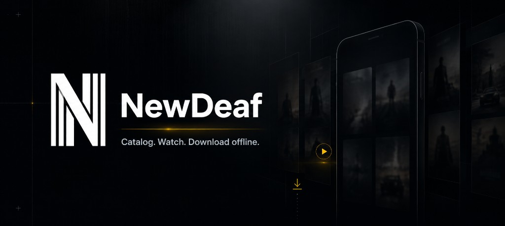
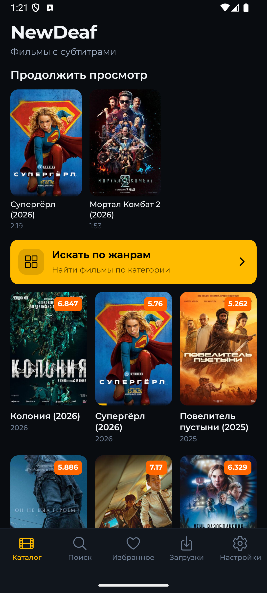
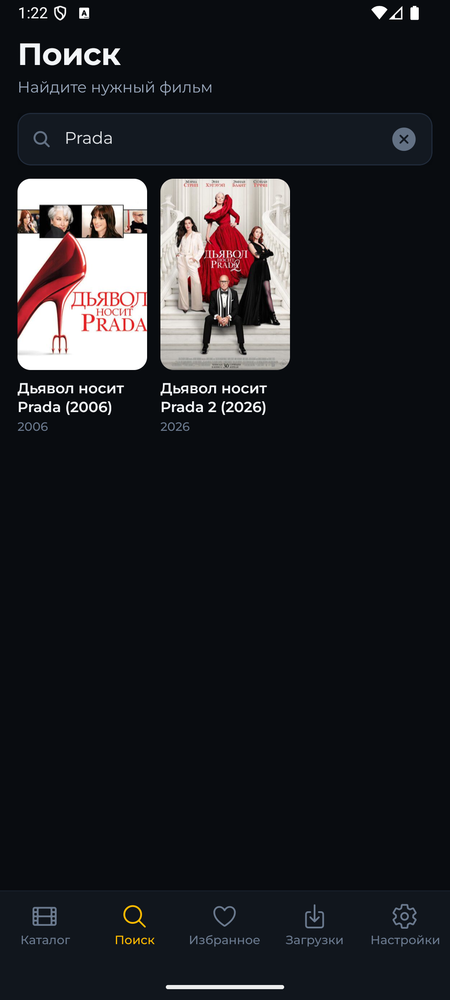
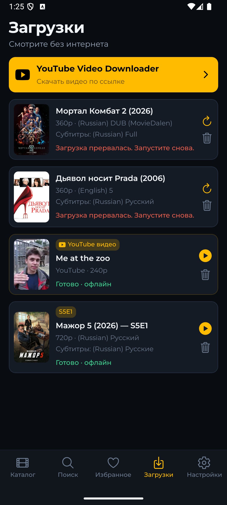
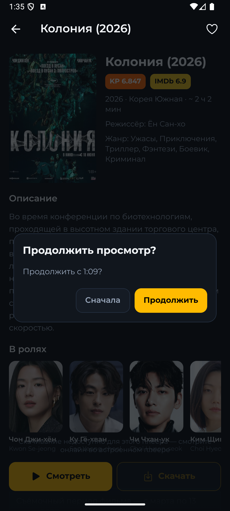
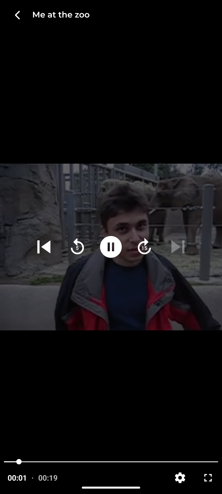
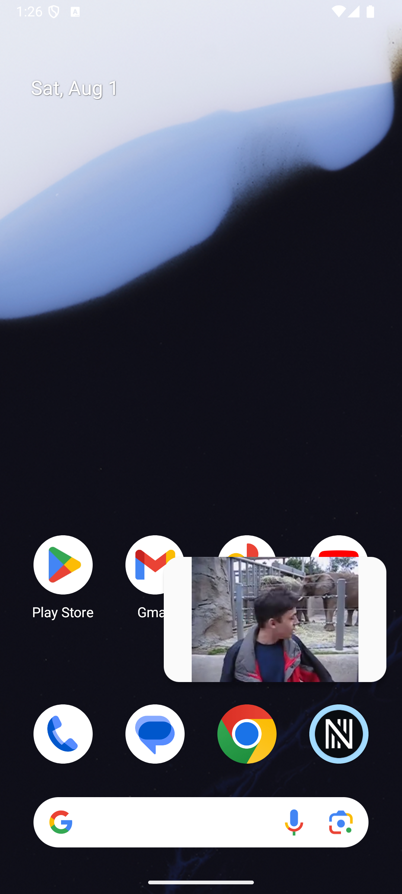

<p align="center">
  
</p>

<p align="center">
  <strong>Native Android client for <a href="https://newdeaf.top">newdeaf.top</a></strong><br />
  Catalog · search · online player · offline library · Picture-in-Picture<br />
  <em>Фильмы с субтитрами — в кармане, с загрузками и нативным плеером.</em>
</p>

<p align="center">
  <a href="https://github.com/kigya/newdeaf-mobile"></a>
  
  
  
  <a href="LICENSE"></a>
</p>

<p align="center">
  Built by <a href="https://github.com/kigya"><strong>kigya</strong></a>
</p>

---

## Screenshots

<table>
  <tr>
    <td align="center" width="25%"><br /><sub>Catalog & Continue Watching</sub></td>
    <td align="center" width="25%"><br /><sub>Search</sub></td>
    <td align="center" width="25%"><br /><sub>Movie details</sub></td>
    <td align="center" width="25%"><br /><sub>Downloads & offline</sub></td>
  </tr>
  <tr>
    <td align="center" width="25%"><br /><sub>Online WebView player</sub></td>
    <td align="center" width="25%"><br /><sub>Native offline player</sub></td>
    <td align="center" width="25%"><br /><sub>Floating PiP window</sub></td>
    <td></td>
  </tr>
</table>

---

## Features

- **New releases catalog** with pull-to-refresh, infinite scroll, and a **Continue Watching** rail
- **Search** (min. 4 characters) with an EN→RU title bridge via TMDB when needed
- **Genres** browsing and filtered lists
- **Movie details** — plot, KP / IMDb ratings, cast, facts; optional TMDB + Kinopoisk enrichment
- **Online playback** via the site player in a WebView (quality / audio / subtitles from the site UI)
- **Downloads** — pick quality, audio track, and subtitles (HLS or progressive); default quality in Settings
- **YouTube downloads** — paste a link, pick quality (Piped / Invidious / youtubei.js)
- **Offline playback** with `expo-video`, local HLS, and VTT subtitles
- **Picture-in-Picture** — native player can shrink to a floating window (Home / multitasking)
- **Favorites** and **watch progress** in SQLite (resume after ~30s; auto-clear when finished)
- **Settings** — language `ru` / `en`, default download quality (`720` by default)
- **Tablet-friendly** layout via breakpoints (orientation unlocked app-wide)

No accounts, cloud sync, payments, or analytics.

---

## How downloads work

NewDeaf treats downloads as a first-class offline library — not a “hope the tab stays open” fetch.

| Situation | What happens |
|-----------|----------------|
| App in background or **screen off** | Android **Foreground Service** + notification keep the job alive |
| Same process, mid-HLS job | Already-downloaded segments are **skipped** (resume within the process) |
| Movie queue | Jobs are **serialized** (one movie at a time); YouTube is **not** on that chain |
| CDN `403` | Media is fetched through a WebView Chrome session (`MediaFetchHost`) when possible |
| App **killed** / process death | In-flight jobs become **`failed` + interrupted** — tap **Retry** (movie partial dir is wiped; signed CDN URLs expire) |

Default download quality comes from Settings (`best` · `1080` · `720` · `480` · `360`); you can override per download in the sheet.

---

## Tech stack

| Layer | Choice |
|-------|--------|
| Framework | Expo **57**, React Native **0.86**, React **19** |
| Language | TypeScript (strict), `@/*` path aliases |
| Routing | Expo Router (file-based) |
| UI | RN `StyleSheet` + tokens in `src/theme/` (Montserrat) |
| Motion | Moti + Reanimated |
| State | Zustand |
| Persistence | expo-sqlite (`newdeaf.db`), expo-file-system for media |
| Online player | Site player in `react-native-webview` |
| Offline player | `expo-video` + local HLS / progressive |
| i18n | i18n-js + expo-localization (`ru` / `en`) |
| YouTube | youtubei.js (+ Piped / Invidious fallbacks) |
| Background | `react-native-background-actions` (FGS) |
| Tests | Jest + jest-expo |

---

## APIs & integrations

| Source | Role |
|--------|------|
| **[newdeaf.top](https://newdeaf.top)** | Catalog, search, details, and player HTML — scraped with plain `fetch` (`src/api/`). **Source of truth for titles.** |
| **TMDB** | Optional localized title/plot/cast; Russian title bridge for Latin search queries |
| **Kinopoisk Unofficial** | Optional facts, cast photos, awards, similar titles on the detail screen |
| **YouTube** (Piped → Invidious → youtubei.js) | Resolve streams for the YouTube download path |

Optional env keys (soft-fail if missing):

```bash
EXPO_PUBLIC_TMDB_API_KEY=
EXPO_PUBLIC_TMDB_READ_TOKEN=
EXPO_PUBLIC_KINOPOISK_API_KEY=
```

There is **no** first-party REST catalog API — enrichment helpers never replace the scrape.

---

## Screens

| Route | What you get |
|-------|----------------|
| `/(tabs)` | Catalog, Continue Watching, genres entry |
| `/(tabs)/search` | Title search |
| `/(tabs)/favorites` | Local favorites |
| `/(tabs)/downloads` | Queue, progress, offline library, YouTube downloader |
| `/(tabs)/settings` | Language, default quality, version |
| `/movie/[id]` | Detail, Watch / Download |
| `/player/...` | Online WebView player |
| `/offline/[downloadId]` | Native offline player (+ PiP) |
| `/genre/...` | Genre lists |

Product behavior and acceptance criteria live under [`prd/`](prd/). Agent/engineering constraints: [`AGENTS.md`](AGENTS.md).

---

## Getting started

```bash
npm install          # runs patch-package via postinstall
npm start            # Metro
npm run android      # debug build (needs Metro)
npm run android:standalone   # release APK with JS bundled
npm test
npm run typecheck
```

`npm run android` loads JS from Metro. For a standalone install that does not need Metro:

```bash
npm run android:standalone
```

APK path: `android/app/build/outputs/apk/release/app-release.apk`  
(The release variant here is signed with the local debug key — for personal install/testing, not Play Store publishing.)

---

## Attribution & license

This project is licensed under the **Attribution License** — see [`LICENSE`](LICENSE).

You may fork, modify, and ship derivatives, provided that you:

1. Keep the copyright and license text, and  
2. Credit **[kigya](https://github.com/kigya)** as the original author, with a link to `https://github.com/kigya`, in your README (or equivalent docs) **and** in the app’s About / Settings (or equivalent).

**Disclaimer:** NewDeaf is an unofficial client. Catalog and media come from third-party sites. Respect copyright and the terms of those services; use at your own risk.

---

## Cite this project

See [`CITATION.cff`](CITATION.cff). Example:

```bibtex
@software{newdeaf,
  author = {{kigya}},
  title = {NewDeaf},
  year = {2026},
  url = {https://github.com/kigya/newdeaf-mobile}
}
```

---

## Community

Please read the [`CODE_OF_CONDUCT.md`](CODE_OF_CONDUCT.md) before contributing.

Issues and discussion: [github.com/kigya/newdeaf-mobile](https://github.com/kigya/newdeaf-mobile)

---

<p align="center">
  Made with care by <a href="https://github.com/kigya">kigya</a>
</p>
